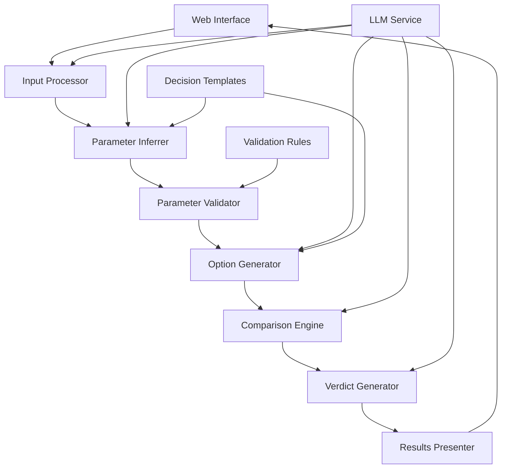

# Design Document: The Referee

## Overview

The Referee is a web-based AI-powered decision intelligence tool that transforms natural language decision scenarios into structured comparisons with transparent reasoning. The system follows a pipeline architecture where user input flows through natural language processing, parameter inference, option generation, comparison analysis, and verdict generation stages.

The design emphasizes transparency, educational value, and user control over the decision-making process. Unlike traditional recommendation systems that provide single answers, The Referee presents multiple viable options with clear trade-offs to help users understand the decision space and make informed choices.

## Architecture

The system follows a modular, pipeline-based architecture with clear separation of concerns:



### Core Components

1. **Web Interface Layer**: React-based frontend providing intuitive user interaction
2. **API Gateway**: RESTful API handling requests and orchestrating the decision pipeline
3. **Natural Language Processing Pipeline**: Processes user input and extracts decision context
4. **Decision Engine**: Core logic for parameter inference, option generation, and analysis
5. **LLM Integration Service**: Manages interactions with large language models
6. **Data Layer**: Stores decision templates, validation rules, and user sessions

## Components and Interfaces

### Input Processor

**Purpose**: Parse and understand natural language decision scenarios

**Interface**:
```typescript
interface InputProcessor {
  processInput(userInput: string): Promise<DecisionContext>
  validateInput(input: string): ValidationResult
  extractDecisionType(input: string): DecisionType
}

interface DecisionContext {
  rawInput: string
  decisionType: DecisionType
  extractedEntities: Entity[]
  confidence: number
  clarificationNeeded: string[]
}
```

**Implementation**: Uses LLM-powered natural language understanding to identify decision type, extract key entities, and determine if additional clarification is needed.

### Parameter Inferrer

**Purpose**: Automatically extract decision parameters from natural language input

**Interface**:
```typescript
interface ParameterInferrer {
  inferParameters(context: DecisionContext): Promise<ParameterSet>
  getBaselineParameters(decisionType: DecisionType): Parameter[]
  validateParameterCompleteness(params: ParameterSet): ValidationResult
}

interface ParameterSet {
  budget: BudgetConstraint
  usage: UsageRequirement[]
  constraints: Constraint[]
  preferences: Preference[]
  timeline: TimelineConstraint
  customParameters: Parameter[]
}

interface Parameter {
  name: string
  value: ConcreteValue  // Never percentage-based
  importance: ImportanceLevel
  source: 'inferred' | 'user_specified'
  confidence: number
}
```

**Implementation**: Combines rule-based extraction with LLM-powered inference. Uses decision type templates to ensure baseline parameters are always included.

### Option Generator

**Purpose**: Generate multiple viable alternatives based on parameters

**Interface**:
```typescript
interface OptionGenerator {
  generateOptions(parameters: ParameterSet): Promise<Option[]>
  validateOptionViability(option: Option, constraints: Constraint[]): boolean
  diversifyOptions(options: Option[]): Option[]
}

interface Option {
  id: string
  name: string
  description: string
  attributes: OptionAttribute[]
  estimatedOutcomes: Outcome[]
  risks: Risk[]
  benefits: Benefit[]
}
```

**Implementation**: Uses constraint satisfaction and LLM-powered creative generation to produce 3-7 distinct, viable options that span the solution space.

### Comparison Engine

**Purpose**: Analyze options against decision criteria and generate structured comparisons

**Interface**:
```typescript
interface ComparisonEngine {
  compareOptions(options: Option[], criteria: Criterion[]): Promise<ComparisonMatrix>
  identifyTradeoffs(matrix: ComparisonMatrix): Tradeoff[]
  assessRisks(options: Option[]): RiskAssessment[]
}

interface ComparisonMatrix {
  options: Option[]
  criteria: Criterion[]
  scores: ComparisonScore[][]
  tradeoffs: Tradeoff[]
  longTermImplications: Implication[]
}

interface Tradeoff {
  criterion1: string
  criterion2: string
  description: string
  severity: 'low' | 'medium' | 'high'
  affectedOptions: string[]
}
```

**Implementation**: Evaluates each option against decision criteria, identifies conflicts and trade-offs, and assesses both short-term and long-term implications.

### Verdict Generator

**Purpose**: Provide justified recommendations with transparent reasoning

**Interface**:
```typescript
interface VerdictGenerator {
  generateVerdict(matrix: ComparisonMatrix, parameters: ParameterSet): Promise<Verdict>
  explainReasoning(verdict: Verdict): ReasoningExplanation
  assessConfidence(verdict: Verdict): ConfidenceAssessment
}

interface Verdict {
  recommendedOption: Option
  reasoning: ReasoningStep[]
  confidence: ConfidenceLevel
  alternatives: AlternativeRecommendation[]
  limitations: string[]
  assumptions: Assumption[]
}

interface ReasoningStep {
  step: number
  description: string
  evidence: Evidence[]
  weight: number
}
```

**Implementation**: Uses multi-criteria decision analysis combined with LLM-powered reasoning to generate transparent, justified recommendations.

## Data Models

### Core Decision Models

```typescript
// Decision Types
enum DecisionType {
  TECH_STACK = 'tech_stack',
  CAREER_MOVE = 'career_move',
  HIRING = 'hiring',
  MAJOR_PURCHASE = 'major_purchase',
  CUSTOM = 'custom'
}

// Constraint Types
interface BudgetConstraint {
  min: number
  max: number
  currency: string
  flexibility: 'strict' | 'flexible' | 'negotiable'
}

interface UsageRequirement {
  type: string
  frequency: string
  intensity: string
  duration: string
}

interface TimelineConstraint {
  urgency: 'immediate' | 'weeks' | 'months' | 'flexible'
  deadline?: Date
  milestones: Milestone[]
}

// Evaluation Models
interface Criterion {
  name: string
  weight: number
  measurementType: 'quantitative' | 'qualitative'
  scale: Scale
}

interface Scale {
  type: 'numeric' | 'ordinal' | 'categorical'
  min?: number
  max?: number
  labels?: string[]
}

// Session Management
interface DecisionSession {
  id: string
  userId?: string
  createdAt: Date
  updatedAt: Date
  status: SessionStatus
  context: DecisionContext
  parameters: ParameterSet
  options: Option[]
  comparison: ComparisonMatrix
  verdict: Verdict
}

enum SessionStatus {
  INPUT_PROCESSING = 'input_processing',
  PARAMETER_REVIEW = 'parameter_review',
  OPTION_GENERATION = 'option_generation',
  COMPARISON_ANALYSIS = 'comparison_analysis',
  VERDICT_READY = 'verdict_ready',
  COMPLETED = 'completed'
}
```

### LLM Integration Models

```typescript
interface LLMRequest {
  prompt: string
  context: Record<string, any>
  temperature: number
  maxTokens: number
  systemPrompt: string
}

interface LLMResponse {
  content: string
  confidence: number
  reasoning?: string
  metadata: Record<string, any>
}

interface PromptTemplate {
  name: string
  template: string
  variables: string[]
  decisionType?: DecisionType
  stage: ProcessingStage
}

enum ProcessingStage {
  INPUT_ANALYSIS = 'input_analysis',
  PARAMETER_EXTRACTION = 'parameter_extraction',
  OPTION_GENERATION = 'option_generation',
  COMPARISON_ANALYSIS = 'comparison_analysis',
  VERDICT_GENERATION = 'verdict_generation'
}
```

Now I need to use the prework tool to analyze the acceptance criteria before writing the Correctness Properties section.

## Correctness Properties

*A property is a characteristic or behavior that should hold true across all valid executions of a system—essentially, a formal statement about what the system should do. Properties serve as the bridge between human-readable specifications and machine-verifiable correctness guarantees.*

### Property 1: Natural Language Processing Robustness
*For any* valid decision scenario input in natural language, the Decision_Engine should successfully extract meaningful decision context regardless of writing style, complexity, or completeness, and identify missing information when present.
**Validates: Requirements 1.1, 1.2, 1.3**

### Property 2: Decision Type Classification Completeness  
*For any* input describing a decision scenario, the Decision_Engine should correctly classify it into one of the supported decision types (tech stack, career move, hiring, major purchase, or custom).
**Validates: Requirements 1.4**

### Property 3: Parameter Extraction Completeness
*For any* decision context, the Parameter_Inferrer should extract all relevant parameters including mandatory baseline parameters (budget, usage, constraints) and appropriate domain-specific parameters for the decision type.
**Validates: Requirements 2.1, 2.2, 2.5**

### Property 4: Concrete Value Constraint Enforcement
*For any* parameter inference or user input, the system should reject percentage-based values and ensure all parameters use concrete values and scales.
**Validates: Requirements 2.3, 3.4**

### Property 5: Parameter Modification Reactivity
*For any* parameter change made by a user, the Decision_Engine should re-analyze the decision using the updated parameters and provide immediate validation feedback.
**Validates: Requirements 3.2, 3.3**

### Property 6: Option Generation Constraints
*For any* finalized parameter set, the Option_Generator should create between 3-7 distinct, viable options that satisfy all specified constraints and span both conventional and innovative approaches.
**Validates: Requirements 4.1, 4.2, 4.3, 4.4**

### Property 7: Option Detail Sufficiency
*For any* generated option, it should contain sufficient detail (attributes, outcomes, risks, benefits) to enable meaningful comparison with other options.
**Validates: Requirements 4.5**

### Property 8: Comparison Matrix Completeness
*For any* set of generated options, the comparison matrix should include structured evaluation against all decision criteria, with explicit identification of trade-offs, risks, benefits, and both short-term and long-term implications.
**Validates: Requirements 5.1, 5.2, 5.3, 5.5**

### Property 9: Verdict Justification Completeness
*For any* comparison analysis, the generated verdict should include a justified recommendation with clear reasoning that references the comparison data, acknowledges limitations and uncertainties, and explains deciding factors when options are close.
**Validates: Requirements 6.1, 6.2, 6.3, 6.5**

### Property 10: Decision Process Transparency
*For any* decision analysis, the system should provide complete transparency by explaining methodology, showing logical flow from input to recommendation, documenting assumptions, and enabling users to understand each step.
**Validates: Requirements 8.1, 8.2, 8.3, 8.4, 8.5**

## Error Handling

### Input Validation Errors
- **Invalid Decision Type**: When input cannot be classified into supported decision types, return error with suggested reformulation
- **Insufficient Information**: When critical parameters cannot be inferred, request specific clarification rather than making assumptions
- **Constraint Conflicts**: When user-specified parameters create impossible constraints, identify conflicts and suggest resolutions

### Processing Errors
- **LLM Service Failures**: Implement retry logic with exponential backoff; fallback to template-based responses for critical functions
- **Parameter Validation Failures**: Reject invalid parameter values with specific error messages and suggested corrections
- **Option Generation Failures**: If fewer than 3 viable options can be generated, explain constraints that limit options and suggest parameter adjustments

### System Errors
- **Session Management**: Handle session timeouts gracefully with ability to restore progress
- **Data Consistency**: Ensure parameter changes trigger complete re-analysis to maintain consistency
- **Resource Limits**: Handle cases where analysis complexity exceeds system limits with appropriate user feedback

### Error Recovery Strategies
- **Graceful Degradation**: When advanced features fail, provide basic comparison functionality
- **User Guidance**: Always provide actionable suggestions for resolving errors
- **Transparency**: Clearly communicate what went wrong and what the system is doing to recover

## Testing Strategy

### Dual Testing Approach

The testing strategy employs both unit testing and property-based testing as complementary approaches:

- **Unit Tests**: Focus on specific examples, edge cases, error conditions, and integration points between components
- **Property Tests**: Verify universal properties across all inputs through comprehensive randomized testing

### Property-Based Testing Configuration

**Framework Selection**: Use Hypothesis (Python) or fast-check (TypeScript) for property-based testing
**Test Configuration**: Minimum 100 iterations per property test to ensure comprehensive coverage
**Test Tagging**: Each property test must reference its design document property using the format:
`Feature: the-referee, Property {number}: {property_text}`

### Unit Testing Focus Areas

**Specific Examples**:
- Test each decision type with representative examples
- Verify parameter extraction for common decision scenarios
- Test comparison matrix generation with known option sets

**Edge Cases**:
- Empty or minimal input handling
- Extreme parameter values (very high/low budgets, tight timelines)
- Single viable option scenarios
- Conflicting constraint resolution

**Error Conditions**:
- Malformed input handling
- LLM service failures and fallback behavior
- Invalid parameter combinations
- Session timeout and recovery

**Integration Points**:
- End-to-end workflow from input to verdict
- LLM service integration and response handling
- Web interface and API integration
- Session state management across components

### Property Test Implementation

Each correctness property must be implemented as a single property-based test:

1. **Property 1 Test**: Generate random decision scenarios with varying complexity and style
2. **Property 2 Test**: Generate inputs for each decision type and verify correct classification
3. **Property 3 Test**: Test parameter extraction across all decision types with random scenarios
4. **Property 4 Test**: Generate various input formats and verify concrete value enforcement
5. **Property 5 Test**: Test parameter modification scenarios and verify reactive behavior
6. **Property 6 Test**: Generate random parameter sets and verify option generation constraints
7. **Property 7 Test**: Verify generated options contain all required detail elements
8. **Property 8 Test**: Test comparison matrix generation with random option sets
9. **Property 9 Test**: Verify verdict generation completeness across various comparison scenarios
10. **Property 10 Test**: Test transparency and explainability across all decision analysis stages

### Coverage Requirements

- **Functional Coverage**: All decision types, parameter types, and analysis stages
- **Input Coverage**: Various natural language styles, decision complexities, and parameter combinations
- **Error Coverage**: All error conditions and recovery scenarios
- **Integration Coverage**: Complete workflows and component interactions

The combination of unit and property tests ensures both concrete correctness validation and comprehensive input space coverage, providing confidence in system reliability across all usage scenarios.